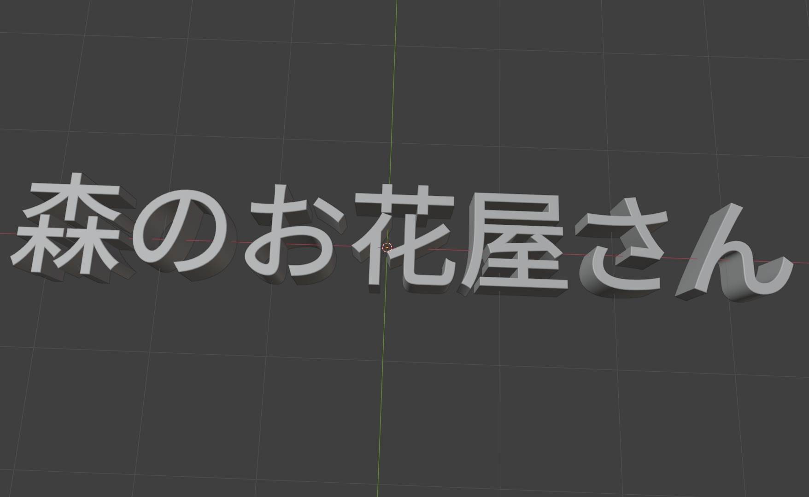
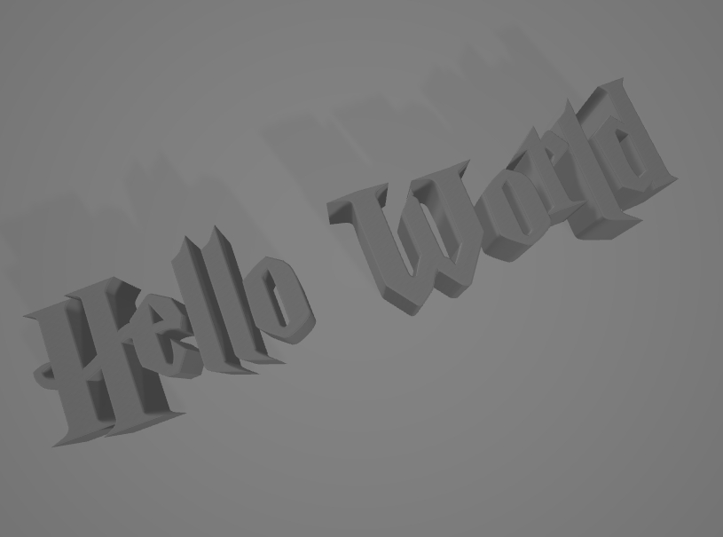

# 3D Text Generator

A Simple Python script that generates 3D text models using Blender's Python API. Convert any text into 3D models suitable for 3D printing, game assets, or other 3D applications.

<div style="display: flex; justify-content: space-between;">
    
    
</div>

## Features

- Convert text to 3D meshes with customizable parameters
- Export to common 3D formats (.obj, .blend)

## Prerequisites

- Blender 3.0 or higher
- Python 3.7+
- FontTools library

## Installation

1. Clone this repository:
```bash
git clone https://github.com/For-Chance/3D-Text-Generator.git
cd 3D-Text-Generator
```

2. Install required Python packages:
```bash
pip install fonttools
```

3. Set up Blender environment:
   - Windows:
     ```bash
     # Add to System Environment Variables -> Path
     C:\Program Files\Blender Foundation\Blender 3.0
     ```
   - macOS:
     ```bash
     # Add to ~/.zshrc or ~/.bash_profile
     export PATH="/Applications/Blender.app/Contents/MacOS:$PATH"
     ```
   - Linux:
     ```bash
     # Add to ~/.bashrc
     export PATH="/usr/local/blender:$PATH"
     ```

## Usage

Basic usage:
```bash
blender --background --python gen.py -- --text "Hello World"
```
Advanced usage with all parameters:
```bash
blender --background --python gen.py -- \
--text "Hello World" \
--font "./fonts/custom.ttf" \
--depth 0.3 \
--resolution 64 \
--bevel 0.02 \
--output "my_text.obj"
```

### Parameters

| Parameter | Description | Default |
|-----------|-------------|---------|
| --text | Text to convert to 3D | "hello" |
| --font | Font file path | "./fonts/hp.ttf" |
| --depth | Text thickness | 0.2 |
| --resolution | Mesh resolution | 32 |
| --bevel | Bevel depth for smoother edges | 0.01 |
| --output | Output file path | auto-generated |

## Project Structure
3d-text-generator/
├── gen.py # Main script
├── fonts/ # Font directory
│ └── hp.ttf # Default font
├── output/ # Generated models
└── assets/ # Example images
